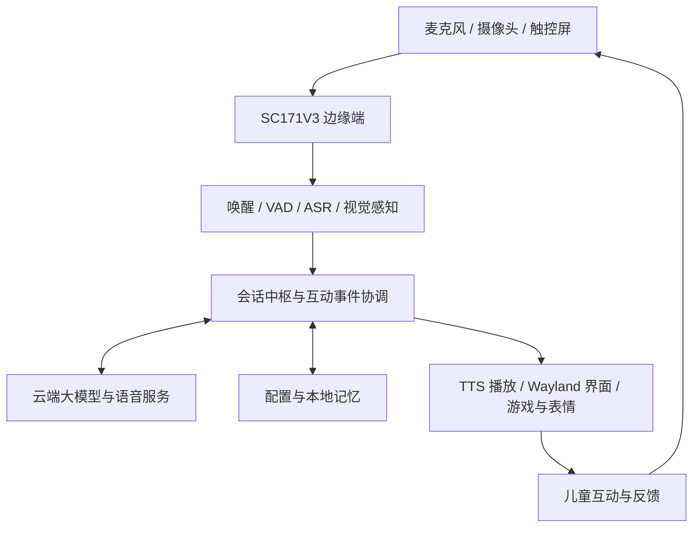

# ⚡ 星宝——基于 SC171V3 的智能儿童早教陪伴桌

> 赛事：全国大学生嵌入式芯片与系统设计竞赛  
> 奖项：全国三等奖  
> 年份：2026  
> 平台：广和通 SC171 开发套件 V3  
> 团队：奇点童行 · 北京邮电大学

## 📖 作品简介

星宝是一套面向学龄前儿童的智能早教陪伴桌系统，基于广和通 SC171V3 开发套件，将语音交流、触控屏互动与桌面视觉感知结合起来，为家庭提供寓教于乐的认知启蒙与日常陪伴体验。孩子可以通过语音、点触和实物摆放参与颜色、形状、记忆等互动活动；系统通过儿童友好的表达、表情反馈和任务引导，鼓励孩子主动探索与表达。项目采用模块化设计，串联语音唤醒、语音识别、大模型对话、语音合成和界面调度，并提供本地语音识别与云端服务接入能力。成长引导、健康用眼提示和情绪陪伴相关逻辑作为应用模块集成，实际效果需在目标硬件和具体部署配置下验证。

## 🧠 核心功能

- 语音交互：唤醒、VAD、ASR、流式大模型回复及 TTS 播放。
- 触控互动：桌面主界面、小游戏、儿童可视化工具和表情动画。
- 多模态感知：本地视觉处理及可选的云端场景描述。
- 陪伴与引导：儿童友好表达、会话管理、记忆管理和互动事件响应。
- 板端部署：原生 Wayland 界面、板端启动脚本、服务管理和健康检查工具。

机械臂相关模块作为历史兼容代码保留，不是当前早教陪伴桌的必需组件。

## 🏗️ 系统架构



云端服务需要自行配置凭据。仓库不包含真实密钥、历史会话或儿童运行记录。

## 📂 目录结构

```text
├── README.md
├── docs/                       # 提交与部署说明
├── hardware/                   # 已知硬件组成及资料边界
├── firmware/                   # 底层固件范围说明
├── edge_computing/
│   └── xingbao_companion_project/
│       ├── main.py / app.py     # 应用入口与编排
│       ├── core/               # 会话、事件、配置与安全逻辑
│       ├── intelligence/       # 对话与表达逻辑
│       ├── multimodal/         # 音频与视觉处理
│       ├── components/         # 触控界面与兼容组件
│       ├── models/             # 模型资源（Git LFS）
│       ├── web/                # 网页互动工具
│       ├── deploy/             # 板端部署脚本
│       └── tests/              # 测试代码
├── cloud/                      # 外部云服务接入说明
└── tools/                      # 仓库辅助说明
```

## 🚀 快速开始

获取本仓库后，先拉取 Git LFS 模型资源，再进入应用目录：

```bash
git lfs install
git lfs pull
cd edge_computing/xingbao_companion_project
python3 -m pip install -r requirements.txt
python3 main.py --help
python3 main.py --text-demo
```

上述入口用于检查应用和文本演示，不代表板端音视频链路已经配置完成。真实语音交互需要麦克风、扬声器、有效云服务凭据和相关依赖；本地 ASR 还需要配套运行时。详见 [部署说明](docs/DEPLOYMENT.md)。

## 提交与资源说明

- 模板来源：[Fiborn/FiBoom-project](https://github.com/Fiborn/FiBoom-project)。
- 提交流程：创建公开作品仓库，再向模板仓库提交作品入驻申请；当前本地准备阶段尚未上传。
- 本仓库基于 2026-09-16 从板卡复制的快照整理，不代表板卡此后的变更。
- 原工程内部结构保留，以兼容现有导入和资源相对路径。
- 排除了虚拟环境、运行日志、缓存、个人运行数据、历史 Git 对象及实验过程目录。
- 原模型、素材和第三方组件随源码保留；它们的权利和许可仍归各自作者，不通过本仓库额外授予许可。未擅自为整个项目添加开源许可证。
