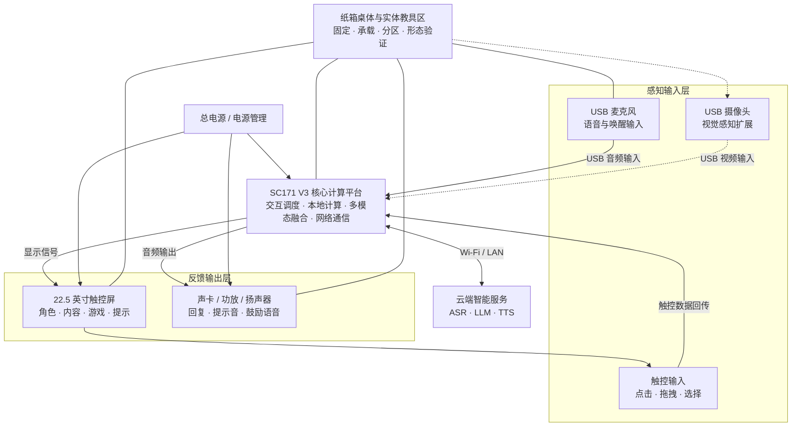
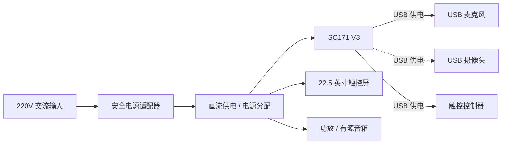
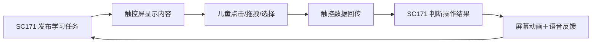
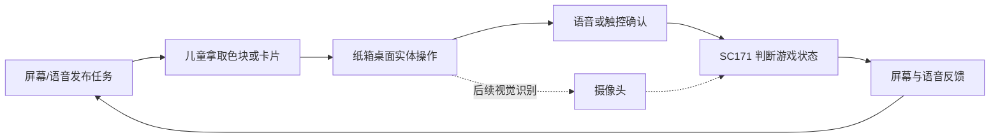

# 星宝智能儿童早教陪伴桌：硬件架构与流程图设计说明

## 1. 文档目的

本文档用于指导比赛汇报中的硬件架构图、硬件关系图和功能闭环图设计。

图中不仅要说明“有哪些硬件”，还要准确表达：

- 各硬件的输入、输出与主要作用；
- 各硬件之间的数据、音频、视频和供电关系；
- 语音、触控、视觉和实体桌面操作形成的交互闭环；
- 纸箱桌体对硬件的固定、承载和空间组织作用；
- 当前已经实现的能力与后续扩展能力之间的区别；
- 整机运行中的回声、散热、线缆和用电安全问题。

本项目当前以 **SC171 V3 开发套件**为核心平台，产品形态为智能儿童早教陪伴桌。当前主线不包含机械臂、舵机、PWM、GPIO 或原始串口控制，主要反馈方式为触控画面、角色动画、语音播报和桌面互动。

---

## 2. 硬件架构总览

整机建议按照以下五个层次组织：

1. **感知输入层**：USB 麦克风、触控输入、USB 摄像头。
2. **核心计算层**：SC171 V3 开发套件。
3. **反馈输出层**：22.5 英寸触控屏、声卡、功放或扬声器。
4. **网络服务层**：Wi-Fi/LAN 与云端 ASR、LLM、TTS 服务。
5. **电源与结构层**：电源适配器、电源分配、纸箱桌体和实体教具区。



> 摄像头当前应根据实际安装和演示状态决定使用实线还是虚线。尚未完成实机接入时，统一使用虚线并标注“扩展能力”。

---

## 3. 核心硬件模块拆解

### 3.1 SC171 V3 核心计算平台

SC171 V3 是整机的计算、通信和交互调度中心，负责连接输入设备、输出设备与云端服务。

主要职责：

- 接收麦克风采集的儿童语音；
- 接收触控屏返回的操作数据；
- 接收摄像头采集的图像数据；
- 运行星宝主界面、小游戏和交互调度程序；
- 进行唤醒检测、VAD、事件管理和本地快速反馈；
- 通过网络调用 ASR、大模型和 TTS 服务；
- 向触控屏输出画面；
- 向声卡或扬声器输出音频。

在图中的建议名称：

> SC171 V3 核心计算平台  
> 交互调度｜本地计算｜多模态融合｜网络通信

根据[广和通赛题选题指南](https://socoss.socchina.net/file/ueditor/image/20260212/eb0bd8fb38fc4f31b37b9e7eeea9afff.pdf)，SC171 V3 开发套件支持 USB、HDMI、音频、LAN、Wi-Fi 等能力。根据 [Fibocom SC171 官方规格](https://www.fibocom.com/jp/products/info_itemid_6054.html)，SC171 模组具备 CPU、GPU、NPU/DSP、多媒体处理和无线通信能力。

> 注意：官方模组规格与开发套件整板规格不能混用，尤其不能把裸模组的供电电压直接标成开发板输入电压。

### 3.2 22.5 英寸触控屏

触控屏同时承担**信息输出**和**操作输入**两种职责，因此必须与 SC171 V3 之间绘制两条方向相反的连接线。

输出关系：

> SC171 V3 → 触控屏：星宝形象、角色表情、学习内容、小游戏画面、交互提示和健康提醒。

输入关系：

> 触控屏 → SC171 V3：点击、拖拽、长按、选择、确认和小游戏操作。

如果实物使用 HDMI 输出画面、USB 回传触控数据，可以在图中明确标注：

- `HDMI：画面输出`；
- `USB：触控数据回传/触控控制器供电`。

如果实物接口尚未确认，则只标注“显示信号”和“触控数据”，不能根据经验填写接口。

### 3.3 USB 麦克风

主要职责：

- 采集儿童语音；
- 提供“星宝星宝”唤醒词输入；
- 为 ASR 语音识别提供音频；
- 监听儿童插话，为语音打断提供输入。

数据关系：

> 儿童语音 → USB 麦克风 → SC171 V3

典型供电关系：

> SC171 V3 USB 接口 → USB 麦克风

当前板端资料已经记录 `USB PnP Sound Device` 作为实测录音设备，详见 [BOARD_UPLOAD_QUICKSTART.md](./BOARD_UPLOAD_QUICKSTART.md)。

### 3.4 摄像头

主要职责：

- 采集儿童面部和桌面区域图像；
- 辅助判断儿童与屏幕的距离；
- 检测摄像头遮挡或视觉不可用状态；
- 为后续色块、卡片和实体教具识别提供输入。

数据关系：

> 儿童/桌面教具 → 摄像头 → SC171 V3

典型供电关系：

> SC171 V3 USB 接口 → USB 摄像头

当前产品第一阶段不强依赖摄像头完成基础游戏。因此，在未完成真实摄像头联调时，应将其标为“视觉感知扩展模块”，并使用虚线连接。

### 3.5 声卡、功放与扬声器

该部分必须按照实物连接方式拆分。

有源音箱方案：

> SC171 V3 音频输出 → 有源音箱 → 儿童

无源扬声器方案：

> SC171 V3 音频输出 → 功率放大模块 → 无源扬声器 → 儿童

主要职责：

- 播放星宝的对话回复；
- 播放唤醒和接收提示音；
- 播放小游戏说明、提示和鼓励语音；
- 播放护眼、喝水和休息提醒；
- 与屏幕动画共同形成视听反馈。

当前板端程序通过 `lahaina` 声卡的 ALSA 播放链路输出提示音和 TTS，详见 [BOARD_UPLOAD_QUICKSTART.md](./BOARD_UPLOAD_QUICKSTART.md)。

### 3.6 网络连接

网络模块负责 SC171 V3 与云端智能服务之间的双向通信。

上行数据：

> SC171 V3 → 网络 → 云端：语音识别请求、对话请求和必要的交互数据。

下行数据：

> 云端 → 网络 → SC171 V3：识别文本、对话结果和合成语音。

图中使用双向箭头，并标注：

> Wi-Fi/LAN｜云端 ASR｜大模型服务｜TTS 语音合成

为了体现系统可靠性，应在 SC171 V3 旁标出本地能力：

> 本地唤醒、触控游戏、快速提示和异常兜底

### 3.7 实体教具

色块、卡片等实体教具当前不与 SC171 V3 发生直接电气连接，而是通过儿童行为参与交互。

当前关系：

> 实体教具 → 儿童操作 → 语音/触控确认 → SC171 V3

视觉扩展关系：

> 实体教具 ⇢ 摄像头 ⇢ SC171 V3

后者在尚未完成视觉联调时使用虚线表示。

### 3.8 纸箱桌体

纸箱桌体不是数据模块，而是整机原型的结构载体和交互空间。

主要作用：

- 固定和支撑触控屏；
- 容纳和保护 SC171 V3 开发板；
- 安装麦克风、扬声器和摄像头；
- 整理电源线、音频线和数据线；
- 划分屏幕显示区与实体教具操作区；
- 验证产品高度、操作范围和整体桌面形态。

纸箱与硬件之间使用灰色无箭头连接线，并标注“固定/承载”，不能画成数据箭头。

---

## 4. 逐条硬件连线清单

制图时可以直接根据下表绘制，避免遗漏或重复连线。

| 编号 | 起点 | 终点 | 方向 | 关系/接口标签 | 状态 |
|---|---|---|---|---|---|
| 1 | USB 麦克风 | SC171 V3 | 单向 | USB 音频输入 | 当前能力 |
| 2 | SC171 V3 | USB 麦克风 | 单向 | USB 供电 | 按实物确认 |
| 3 | 触控屏 | SC171 V3 | 单向 | 触控数据回传 | 当前能力 |
| 4 | SC171 V3 | 触控屏 | 单向 | 显示信号/画面输出 | 当前能力 |
| 5 | USB 摄像头 | SC171 V3 | 单向 | USB 视频输入 | 按接入状态 |
| 6 | SC171 V3 | USB 摄像头 | 单向 | USB 供电 | 按实物确认 |
| 7 | SC171 V3 | 声卡/功放/扬声器 | 单向 | 音频输出 | 当前能力 |
| 8 | SC171 V3 | Wi-Fi/LAN/云端 | 双向 | 网络通信 | 当前能力 |
| 9 | 总电源 | SC171 V3 | 单向 | 直流供电 | 电压待确认 |
| 10 | 总电源 | 触控屏 | 单向 | 直流供电 | 电压待确认 |
| 11 | 总电源 | 功放/有源音箱 | 单向 | 直流供电 | 按实物确认 |
| 12 | 纸箱桌体 | 各硬件 | 无方向 | 固定/承载 | 当前结构 |
| 13 | 实体教具 | 儿童 | 行为关系 | 拿取/摆放/操作 | 当前能力 |
| 14 | 儿童 | 麦克风/触控屏 | 行为关系 | 语音/触控确认 | 当前能力 |
| 15 | 实体教具 | 摄像头 | 单向虚线 | 视觉采集 | 扩展能力 |
| 16 | 扬声器 | 麦克风 | 单向红色虚线 | 声学回声/串音 | 干扰关系 |

---

## 5. 电源关系

建议在总图底部设置一条“直流供电母线”，由电源管理模块统一向各负载分支供电。



制图规则：

- 供电线使用红色粗实线；
- 数据线与供电线分开绘制；
- USB 设备若由开发板供电，不再重复连接总电源；
- 只有读取实物适配器标签后，才能填写 5V、12V、电流和额定功率；
- 如果屏幕和开发板分别使用独立适配器，应分别画出，不得合并成虚构的统一电源模块。

---

## 6. 四条核心功能闭环

### 6.1 语音陪伴闭环


屏幕应同步呈现“正在聆听—正在思考—正在回答”等状态，因此 SC171 的处理结果会同时分流到触控屏和扬声器。

### 6.2 触控学习闭环



### 6.3 视觉健康闭环


在摄像头尚未完成真实接入时，该闭环应标注“视觉扩展闭环”。

### 6.4 实体桌面游戏闭环



---

## 7. 交叉关系与工程约束

### 7.1 触控屏的输入/输出交叉关系

触控屏既是输出设备，也是输入设备。图中不能只画 SC171 向屏幕输出画面，还必须画屏幕向 SC171 回传触控数据。

### 7.2 USB 总线共享关系

麦克风、摄像头和触控控制器可能共享 SC171 的 USB 资源。制图时可以使用“USB 总线”汇聚节点，但最终接口分配需要根据实际接线确认。

工程上需要关注：

- USB 接口数量；
- USB Hub 是否外接；
- 摄像头带宽；
- 多个 USB 设备同时工作时的供电能力；
- USB 枚举顺序变化导致的设备编号变化。

### 7.3 音频回声关系

扬声器的播放声音可能重新进入麦克风，造成星宝被自己的声音打断。

图中使用红色虚线表示：

> 扬声器 ⇢ 麦克风：声学回声/串音

对应措施：

- 麦克风和扬声器保持物理间隔；
- 避免二者正面相对；
- 控制扬声器音量；
- 使用回声抑制或播放状态控制；
- 根据实机测试调整 VAD 阈值。

### 7.4 网络与本地能力关系

云端服务为语音识别、对话生成和语音合成提供能力，但触控游戏、唤醒检测、快速提示和异常兜底应尽量保留在本地，避免将所有交互完全依赖网络。

### 7.5 纸箱结构与散热关系

纸箱容易加工，适合原型验证，但不能把开发板和电源完全密封。

需要保证：

- SC171 V3 周围有散热空间和通风开口；
- 市电适配器尽量放置在纸箱外；
- 纸箱内部只保留安全低压线路；
- 电源线和音频线分区整理；
- 插头、接口和线缆具备防拉扯措施；
- 儿童可接触边缘进行包边处理；
- 开发板、转接板和裸露焊点与纸板之间增加绝缘固定层。

---

## 8. 比赛流程图版式规范

### 8.1 总图布局

建议使用“五区布局”：

```text
                         云端智能服务
                               ⇅

感知输入层  ─────→  SC171 V3 核心层  ─────→  反馈输出层
麦克风/触控/摄像头        计算与调度          屏幕/扬声器
                               ⇅

                 电源层＋纸箱结构＋实体教具区
```

### 8.2 颜色和线型

| 类型 | 推荐样式 | 含义 |
|---|---|---|
| 供电关系 | 红色粗实线 | 电源输入与供电分配 |
| 当前数据连接 | 蓝色实线 | 已实现的数据通信 |
| 双向通信 | 蓝色双向箭头 | 触控、网络等双向数据 |
| 音频链路 | 紫色实线 | 麦克风、声卡、扬声器 |
| 视觉链路 | 绿色实线/虚线 | 摄像头与视觉处理 |
| 结构关系 | 灰色无箭头线 | 固定、承载和空间关系 |
| 扩展能力 | 对应颜色虚线 | 尚未作为基础能力落地 |
| 干扰关系 | 红色虚线 | 回声、发热等负向耦合 |

### 8.3 连线原则

- 使用横平竖直的正交连线；
- 使用“USB 总线”“电源母线”“反馈总线”等汇聚节点减少线条混乱；
- 数据流、供电流和物理结构关系必须使用不同样式；
- 每条线必须有接口或功能标签，不能只画无说明箭头；
- 交叉关系需要表达清楚，但不能为了“显得复杂”而制造无意义交叉；
- 当前能力使用实线，扩展能力使用虚线；
- 右侧说明文字应与图中的编号一一对应。

---

## 9. 汇报页面右侧说明文字

以下内容可直接放入硬件设计汇报页面：

1. **核心计算平台**：采用 SC171 V3 开发套件作为整机计算与通信中枢，负责语音、触控、视觉和小游戏的统一调度，并连接本地外设与云端智能服务。

2. **触控交互模块**：采用 22.5 英寸触控屏显示星宝形象、学习内容和益智游戏，同时接收儿童的点击、拖拽、选择与确认操作，形成完整的双向触控闭环。

3. **语音交互模块**：USB 麦克风负责语音采集，声卡和扬声器负责回复播放。系统结合唤醒、语音识别、大模型和语音合成，实现“听取—理解—回应”的自然语音闭环。

4. **视觉感知模块**：摄像头作为多模态扩展输入，可用于儿童距离检测、健康用眼提醒和后续桌面实体教具识别。

5. **网络通信模块**：SC171 V3 通过 Wi-Fi 或 LAN 与云端服务双向通信，获取语音识别、智能对话和语音合成能力，同时保留本地唤醒、触控游戏和异常兜底能力。

6. **电源与结构设计**：电源系统分别为核心板、触控屏和音频设备供电；纸箱桌体负责硬件固定、线缆整理、桌面分区和产品形态验证，构成低成本、易迭代的早教陪伴桌原型。

---

## 10. 制图前必须确认的实物参数

下列信息确认后，才能把功能架构图升级为工程接线级关系图：

- [ ] 触控屏具体型号和尺寸；
- [ ] 屏幕图像输入接口；
- [ ] 屏幕触控回传接口；
- [ ] 屏幕供电电压、电流及适配器型号；
- [ ] SC171 V3 开发板实际供电电压、电流及适配器型号；
- [ ] USB 麦克风型号；
- [ ] 摄像头型号、接口和是否已实际接入；
- [ ] 扬声器为有源音箱还是无源扬声器；
- [ ] 是否存在独立功放模块；
- [ ] 麦克风、摄像头和触控控制器是否经过 USB Hub；
- [ ] 网络演示使用 Wi-Fi 还是 LAN；
- [ ] 纸箱内部各部件的实际安装位置；
- [ ] 总电源是否统一，还是开发板、屏幕和音箱分别供电。

未确认的接口和电压必须标注“待确认”，不得为了图面完整而自行推测。

---

## 11. 建议的比赛交付物

建议最终制作以下四张图：

1. **整机硬件总体架构图**：展示全部硬件、数据、供电、网络和结构关系。
2. **多模态交互闭环图**：展示语音、触控、视觉和实体桌面四条闭环。
3. **电源与接口连接图**：展示电源分配、USB 总线、显示接口和音频接口。
4. **实体原型布局图**：结合纸箱桌体照片，标注屏幕区、教具区、麦克风、扬声器、摄像头、核心板和走线位置。

总架构图用于评委快速理解，闭环图用于解释产品逻辑，接口图用于证明工程完整性，实体布局图用于说明方案已经形成可运行的桌面原型。

---

## 12. LaTeX 关系图与生成提示词

比赛汇报版硬件关系图已经整理为可独立编译的 TikZ/LaTeX 文件：

- [`hardware_relationship_diagram.tex`](./hardware_relationship_diagram.tex)：16:9 横版硬件关系图，左侧为硬件关系总图，右侧为核心部件及作用。
- [`HARDWARE_RELATIONSHIP_DIAGRAM_PROMPT.md`](./HARDWARE_RELATIONSHIP_DIAGRAM_PROMPT.md)：用于 AI 制图、矢量重绘或交给制图同学的完整提示词。

推荐使用 XeLaTeX 编译：

```bash
xelatex hardware_relationship_diagram.tex
```

也可以将 `.tex` 文件直接上传 Overleaf，编译器选择 `XeLaTeX`。在导出正式比赛图片前，需要根据第 10 节的实物确认清单补齐真实接口、电压和设备型号。
