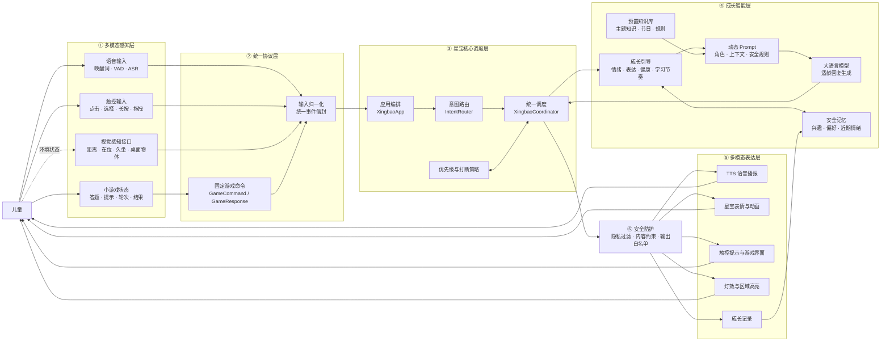
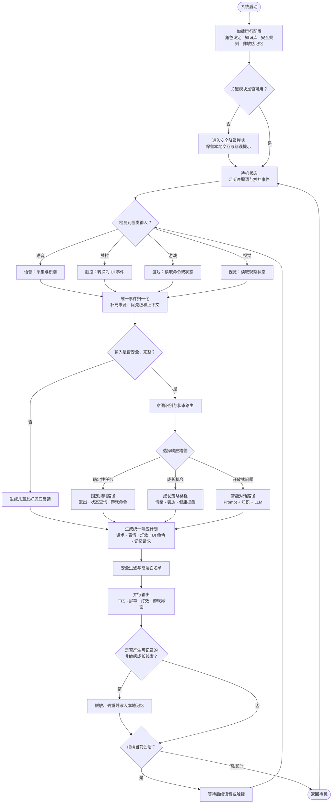
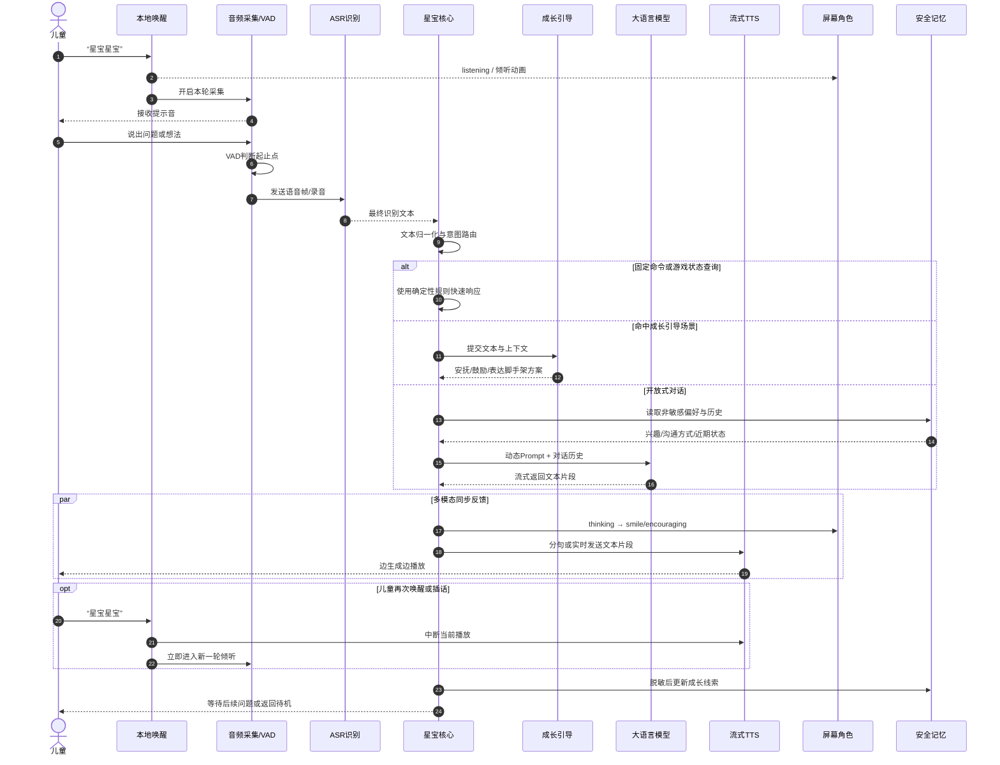
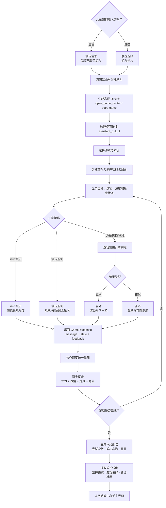
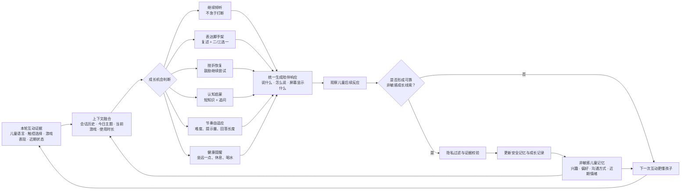
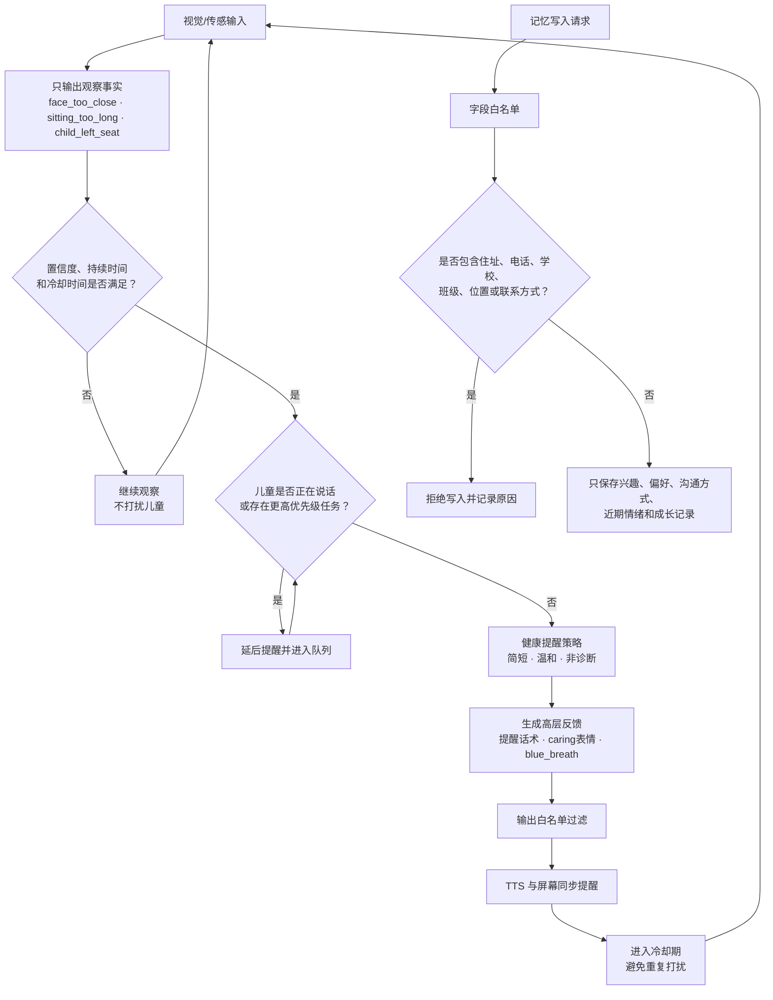
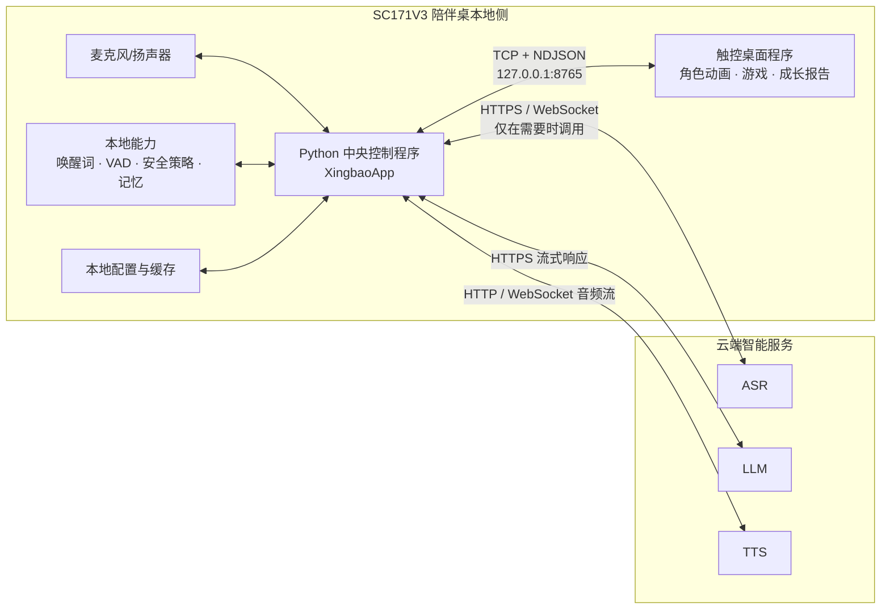

# 星宝软件系统比赛级流程图设计稿

## 1. 设计目标

本设计稿用于软件设计汇报、项目答辩和比赛展示。它不把全部代码堆进一张图，而是用“1 张总览图 + 5 张关键流程图”逐层说明：

1. 星宝由哪些软件层组成。
2. 语音、触控、游戏和视觉信息如何进入系统。
3. 核心调度层如何完成意图识别、成长引导和安全决策。
4. 语音、屏幕、灯效与游戏如何协同反馈。
5. 儿童记忆、隐私和输出安全如何形成可信闭环。

汇报主线统一为：

> 多模态输入 → 统一事件 → 核心理解与调度 → 安全响应计划 → 多模态反馈 → 非敏感成长记录

当前产品主线不包含机械臂、舵机、PWM、GPIO 或原始串口控制。相关历史兼容模块不进入比赛主架构图。

## 2. 图组结构

| 页码 | 图名 | 回答评委的问题 | 建议讲解时间 |
| --- | --- | --- | --- |
| 1 | 软件系统总体架构图 | 系统由什么组成，各模块是什么关系？ | 45 秒 |
| 2 | 软件主控流程图 | 一次完整互动是怎样运行的？ | 50 秒 |
| 3 | 实时语音交互流程图 | 从唤醒到回答，语音链路如何降低等待感？ | 50 秒 |
| 4 | 触控与小游戏协同流程图 | 语音、触控和游戏如何双向协作？ | 50 秒 |
| 5 | 成长引导与个性化闭环图 | 星宝为什么不仅是聊天机器人？ | 45 秒 |
| 6 | 视觉健康与安全防护图 | 儿童隐私、健康提醒和输出安全如何保证？ | 45 秒 |

## 3. 功能模块细分

### 3.1 应用编排层

核心模块：`XingbaoApp`

- 完成系统初始化与运行模式管理。
- 连接语音、对话、成长引导、触控界面和输出模块。
- 管理单轮语音、连续对话、游戏协同和结构化事件回放。
- 记录语音链路事件和调试 trace，便于比赛现场定位问题。

### 3.2 多模态感知层

#### 语音输入

- 本地唤醒词：待机阶段识别“星宝星宝”。
- 音频采集：读取麦克风 PCM 音频。
- VAD：检测儿童开始说话和结束说话。
- ASR：将语音转换为儿童文本。
- 文本归一化：修正星宝名称的常见识别偏差。

#### 触控输入

- 接收点击、选择、长按、确认、返回和游戏操作。
- 将界面行为转换为固定的 UI 事件或游戏状态。
- 触控与语音是并列的核心输入，不是语音失败后的补救方式。

#### 小游戏输入

- 上报游戏开始、答对、答错、请求提示、回合结束和游戏完成。
- 提供分数、星星、轮次、难度、剩余任务等结构化状态。
- 不直接调用 TTS，不直接写入长期记忆。

#### 视觉感知接口

- 接收孩子在位、离位、回座、距离过近、久坐和桌面物体等观察结果。
- 只描述可观察状态，不给出医疗、心理或注意力结论。
- 当前以统一 `vision_state` 接口和健康策略为主，摄像头模型可按比赛阶段接入。

### 3.3 输入归一化与协议层

核心模块：`state_inputs`、统一事件信封、`GameCommandAdapter`

- 将语音文本、`touch_event`、`game_response`、`mini_game_state` 和 `vision_state` 转为统一事件。
- 固定事件来源、类型、优先级和 payload，降低模块耦合。
- 游戏命令只使用固定 intent，例如查询规则、请求提示、暂停、下一轮和退出。
- 模块之间传递“语义和状态”，而不是底层硬件命令。

### 3.4 核心调度层

核心模块：`XingbaoCoordinator`、`IntentRouter`、`ToolRegistry`

- 识别问候、求助、进入游戏、退出活动和游戏状态查询等意图。
- 判断当前输入应该走固定响应、游戏命令、成长引导还是大模型对话。
- 根据事件优先级管理打断、排队和兜底。
- 生成统一 `CoordinationPlan`，供输出层执行。

### 3.5 成长智能层

核心模块：`GrowthGuidanceEngine`、`PromptBuilder`、知识库、`DashScopeLLMClient`

- 判断儿童当前是在提问、表达情绪、需要帮助、请求陪玩还是表达不清。
- 优先使用安全、稳定的本地策略处理健康提醒、情绪安抚和固定游戏请求。
- 需要开放式回答时，组合角色设定、儿童安全规则、当前上下文、知识卡和非敏感记忆。
- 调用大语言模型生成简短、温和、适龄且可继续互动的回答。

### 3.6 会话与安全记忆层

核心模块：`SessionManager`、`ProfileExtractor`、`MemoryManager`

- 保存当前会话历史，支持连续对话。
- 从儿童表达中提取兴趣、喜欢的游戏、沟通方式和近期情绪。
- 写入前执行字段白名单和敏感文本过滤。
- 禁止保存住址、电话、学校、班级、精确位置和家长联系方式。

### 3.7 多模态表达层

核心模块：`ExpressionDispatcher`、TTS、屏幕 UI、`BoardUIClient`、`ActionBus`

- 统一生成播报文本、屏幕文字、星宝表情、灯效和 UI 命令。
- TTS 支持分句排队和实时流式播放。
- 屏幕显示倾听、思考、鼓励、开心、休息等角色状态。
- 中央控制程序与触控桌面通过本地 TCP/NDJSON 消息交换高层指令与结果。
- 输出动作必须经过白名单与 sanitizer，不允许模型直接生成底层控制指令。

### 3.8 可观测与容错层

- 语音链路记录唤醒、ASR 完成、模型首字、TTS 首段和播放完成等事件。
- 输出 trace 区分 planned、applied、played、blocked 和 failed。
- 云端接口不可用时保留本地固定回应、缓存语音或安全兜底文案。
- 触控界面、游戏或视觉模块失败时返回结构化错误，不让主进程失控。

## 4. 图一：软件系统总体架构图

### 4.1 图中内容

### 4.2 页面配文

星宝采用“多模态感知—统一协议—核心调度—成长智能—多模态表达”的分层软件架构。语音、触控、小游戏和视觉模块只负责提交结构化事件，由核心调度层结合会话上下文、安全记忆、知识库和成长策略统一决策，再通过语音、表情、触控界面和灯效形成一致反馈。该架构使输入设备、AI 模型和显示终端能够独立替换，而不改变上层陪伴逻辑。

### 4.3 口播重点

> 我们没有让语音、游戏和视觉模块各自控制星宝，而是把它们统一接入核心调度层。这样可以避免声音重叠、提示冲突和人格不一致，也让后续更换 ASR、视觉模型或触控界面时，不需要重写整个系统。

## 5. 图二：软件主控流程图

### 页面配文

系统启动后首先加载配置、角色、知识和安全规则，并完成模块自检。运行期间，所有语音、触控、游戏和视觉输入先被转换为统一事件，再根据任务确定性选择固定规则、成长策略或智能对话三条路径。三条路径最终汇合为统一响应计划，经过安全过滤后同步驱动语音、表情、灯效和界面，并按需更新非敏感成长记忆。

## 6. 图三：实时语音交互流程图

### 页面配文

语音链路采用本地唤醒、VAD 端点检测、ASR 识别、分路径决策和流式 TTS 输出。系统对固定任务采用快速响应，对情绪和表达场景优先使用成长策略，对开放式问题再调用大模型。模型生成与语音播放可流水化进行，并支持儿童再次唤醒打断播报，降低等待感并增强自然对话体验。

### 评委追问时可讲

- 待机唤醒在本地完成，不需要持续上传环境音频。
- 固定任务不依赖大模型自由生成，响应更稳定。
- TTS 支持分句队列和实时音频流，减少“问完后长时间没反应”。
- 播报期间可以通过唤醒词打断，适合儿童表达节奏不稳定的场景。

## 7. 图四：触控与小游戏协同流程图

### 页面配文

触控与语音共享同一套游戏语义。儿童既可以通过语音进入游戏，也可以直接触控选择；中央调度只发送“打开游戏、开始某游戏、暂停或退出”等高层命令。游戏模块独立负责规则和状态判定，并通过标准 `GameResponse` 返回话术建议、局内状态和高层反馈。最终播报和角色表达仍由星宝核心统一调度，避免游戏模块直接抢占声音或破坏角色一致性。

### 游戏子模块可展示

| 游戏 | 核心训练目标 | 输入方式 | 自适应点 |
| --- | --- | --- | --- |
| 找颜色 | 颜色识别与匹配 | 点触颜色选项 | 选项数量、干扰色 |
| 认形状 | 图形辨识与分类 | 点触目标图形 | 形状相似度、选项数量 |
| 记忆小路 | 顺序记忆与注意保持 | 按顺序触控位置 | 序列长度、展示时长 |
| 数数游戏 | 数量感知与基础数概念 | 点触数量答案 | 数量范围、干扰项 |
| 英语游戏 | 基础词汇与听辨 | 语音提示 + 触控选择 | 词汇难度、选项数量 |
| 本领挑战 | 基础逻辑和简单运算 | 触控答案 | 题型、步数、难度等级 |

## 8. 图五：成长引导与个性化闭环图

### 页面配文

星宝的核心价值不是完成一次问答，而是识别当前最合适的陪伴机会。系统综合儿童表达、触控选择、游戏表现和历史偏好，判断此刻应该继续倾听、帮助表达、鼓励重试、进行认知启蒙、调整难度还是发出健康提醒。只有具有明确证据且不涉及敏感信息的线索才会写入安全记忆，使后续互动逐步适应儿童的兴趣、沟通方式和学习节奏。

## 9. 图六：视觉健康与安全防护图

### 页面配文

视觉模块只上报可观察事实，健康策略结合置信度、持续时间、提醒冷却和当前交互优先级决定是否提醒，不进行医疗或心理推断。所有输出只允许高层表情、灯效和界面状态；所有记忆写入必须经过字段白名单与敏感信息过滤。这样既能提供儿童健康守护，又避免过度提醒、隐私收集和模型越权控制。

## 10. 部署与通信关系图

这张图适合在评委追问“运行在哪里、模块如何通信”时作为备份页。

## 11. 比赛级视觉规范

### 11.1 颜色编码

| 类别 | 建议颜色 | 用途 |
| --- | --- | --- |
| 输入/感知 | 青蓝 `#24B7D3` | 语音、触控、游戏、视觉 |
| 协议/调度 | 深蓝 `#3456D1` | 归一化、意图路由、核心调度 |
| 智能/成长 | 紫色 `#7C5CFC` | 成长引导、Prompt、知识库、LLM |
| 输出/反馈 | 橙色 `#FF9E45` | TTS、屏幕、灯效、UI |
| 记忆/记录 | 绿色 `#36B37E` | 安全记忆、成长记录 |
| 安全/异常 | 红色 `#E85D75` | 隐私过滤、兜底、错误分支 |
| 中性背景 | 灰白 `#F5F7FB` | 分区背景和次级说明 |

### 11.2 图形语义

- 圆角矩形：软件模块或处理步骤。
- 菱形：条件判断，只写一个问题。
- 圆角起止框：开始、待机或结束状态。
- 实线箭头：主数据流。
- 虚线箭头：环境观察、可选反馈或未来接口。
- 双向箭头：真正存在请求与响应的数据交换。
- 每个框最多两行，每行尽量不超过 10 个汉字。

### 11.3 状态标识

正式 PPT 可以在模块右上角加小标签：

- `已实现`：当前代码和联调链路已具备。
- `已预留`：协议和适配层已存在，设备或模型待接入。
- `可扩展`：后续可增加，但不影响当前主流程。

不要在主图中展示 `legacy` 机械臂、串口或旧色块原型。若评委询问，可说明历史兼容代码与新主线通过安全边界隔离。

## 12. 排版建议

### 总览页

- 左侧 35%：两段架构说明文字。
- 右侧 65%：五层架构图。
- 页面底部放一句结论：**所有模块提交事件，星宝核心统一决策与表达。**

### 分流程页

- 左侧 65%：主流程图。
- 右侧 35%：技术亮点、异常策略和一句场景示例。
- 主链路使用粗实线，异常与回退使用细虚线。
- 每页只强调一个创新点，避免同时讲模型、游戏、健康和隐私。

## 13. 总结页核心表达

> 星宝通过统一事件协议把语音、触控、小游戏和视觉感知接入同一核心调度系统；通过成长引导层决定何时倾听、追问、鼓励、教学或提醒；通过安全记忆形成持续个性化；最终以语音、角色表情、触控画面和灯效构成自然、一致且可控的儿童成长陪伴闭环。

