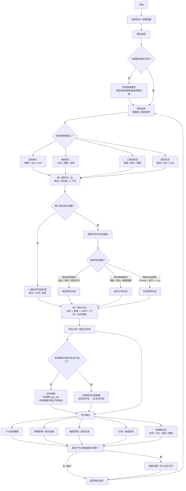

# 星宝软件系统机械臂协同补充材料

> 适用场景：比赛答辩补充材料、软件设计说明附录、流程图讲解页。  
> 核心定位：机械臂是星宝多模态表达层的一部分，负责“安全、有限、可解释”的陪伴动作反馈；软件只输出高层动作意图，不直接输出舵机角度、PWM、GPIO 或原始串口命令。

## 1. 补充材料目的

本补充材料用于说明星宝软件系统中“机械臂”与语音、触控、视觉、小游戏、表情、灯效之间的关系。

在比赛汇报中，机械臂不应该被描述成一个孤立外设，也不应该被描述成由大模型直接控制的硬件。更专业的表达是：

星宝软件系统先理解孩子的输入和当前场景，再生成统一响应计划，最后由安全适配层把响应计划拆分成语音、屏幕表情、界面提示、灯效和机械臂动作。机械臂只执行经过白名单校验的高层动作，例如挥手、点头、摇头、指向左侧、指向右侧、鞠躬或简单庆祝。

这样写的好处是：既保留机械臂的展示亮点，又能体现系统安全、可控、模块化和儿童友好。

## 2. 一句话汇报口径

星宝的软件系统以语音、触控、视觉和小游戏为输入，以核心调度模块为大脑，统一生成儿童友好的响应计划，并通过语音播报、屏幕表情、灯效、界面提示和机械臂高层动作进行协同反馈；机械臂不直接接收大模型指令，而是由安全适配层执行白名单动作，保证儿童互动过程安全可控。

## 3. 机械臂在软件系统中的角色

机械臂不是系统“大脑”，也不是独立决策模块，而是多模态表达层中的一个输出通道。

它主要承担四类作用：

| 作用 | 示例场景 | 机械臂表达 |
| --- | --- | --- |
| 欢迎与唤醒 | 孩子说“星宝星宝”后进入交互 | 挥手 `wave_hand` |
| 肯定与鼓励 | 孩子答对题目、完成任务 | 点头 `nod` 或小庆祝 `small_dance` |
| 否定与纠错 | 孩子答错，但需要温和反馈 | 轻微摇头 `shake_head` |
| 空间引导 | 引导孩子看左侧/右侧选项或桌面区域 | 指向左侧 `point_left` / 指向右侧 `point_right` |
| 礼貌收束 | 游戏结束、对话结束、休息提醒 | 鞠躬 `bow` 或保持安静 `stay_still` |

机械臂的重点不是完成复杂运动，而是用简单、可理解的肢体语言增强陪伴感。

## 4. 软件总流程：含机械臂协同版本



这张图的讲解重点是：机械臂不在前面抢决策权，而是在统一响应计划之后，由安全过滤和动作适配器控制。这样能清楚体现“智能决策在软件中枢，机械臂只是安全表达出口”。

## 5. 软件模块拆解

### 5.1 输入感知层

输入感知层负责接收孩子和环境产生的信息。

包含：

- 语音输入：唤醒词、VAD、ASR；
- 触控输入：点击、拖拽、选择、确认、返回；
- 小游戏状态：答对、答错、请求提示、回合结束、游戏完成；
- 视觉状态：孩子是否在位、距离是否过近、是否久坐、是否需要休息提醒。

这一层只负责“看见发生了什么”，不直接控制机械臂。

### 5.2 统一事件归一化层

不同输入来源的数据格式不同。语音是文本，触控是坐标或按钮事件，小游戏是结构化结果，视觉是状态判断。

统一事件归一化层会把这些输入整理成标准事件：

| 字段 | 含义 |
| --- | --- |
| `source` | 事件来源，例如 voice、touch、game、vision |
| `intent` | 初步意图，例如 ask、answer、help、start_game、health_alert |
| `priority` | 优先级，例如健康提醒高于普通聊天 |
| `context` | 当前游戏、当前轮次、孩子状态和会话上下文 |
| `payload` | 具体内容，例如识别文本、按钮 ID、游戏结果 |

归一化之后，后续模块不需要关心输入来自哪里，只需要处理“孩子现在想做什么”。

### 5.3 核心调度层

核心调度层是整个软件流程的大脑。

它负责：

1. 判断孩子当前意图；
2. 判断当前是否在游戏中；
3. 判断是否存在健康、安全或情绪优先事件；
4. 决定走固定规则、成长策略还是智能对话；
5. 生成统一响应计划。

例如：

- 孩子说“我想玩找颜色” → 进入小游戏路径；
- 孩子答对颜色题 → 进入游戏鼓励路径；
- 视觉检测距离过近 → 进入健康提醒路径；
- 孩子说“我不会” → 进入情绪支持与提示路径；
- 孩子问开放问题 → 进入智能对话路径。

机械臂不参与意图识别，它只接收核心调度生成的动作意图。

### 5.4 统一响应计划层

统一响应计划是机械臂协同的关键。

星宝不会让语音模块、屏幕模块、游戏模块、灯效模块和机械臂模块各自随意输出，而是先生成一份统一计划：

```json
{
  "speech_text": "答对啦，你找到的是红色！",
  "screen_expression": "smile",
  "ui_command": "show_success_animation",
  "led_mode": "warm_breath",
  "arm_action": "nod"
}
```

这份计划表达的是“星宝要如何回应孩子”，其中 `arm_action` 只是一个高层动作名称，不包含舵机角度或底层硬件参数。

### 5.5 安全过滤与白名单层

安全过滤层是机械臂接入时最重要的保护机制。

它需要完成三件事：

1. 内容安全：语音回答必须适合儿童；
2. 隐私安全：不记录儿童敏感信息；
3. 动作安全：机械臂只能执行白名单动作。

当前机械臂高层动作建议白名单：

| 动作名 | 中文含义 | 推荐场景 |
| --- | --- | --- |
| `stay_still` | 保持不动 | 默认状态、降级状态、安全兜底 |
| `wave_hand` | 挥手 | 唤醒、欢迎、游戏开始、告别 |
| `nod` | 点头 | 答对、确认、鼓励 |
| `shake_head` | 摇头 | 答错、温和纠错 |
| `point_left` | 指向左侧 | 引导左侧选项或左侧桌面区域 |
| `point_right` | 指向右侧 | 引导右侧选项或右侧桌面区域 |
| `small_dance` | 小庆祝 | 完成任务、获得奖励 |
| `bow` | 鞠躬 | 礼貌结束、感谢互动 |
| `group_1` | 预设动作组 | 比赛展示或固定演示流程 |

不允许输出：

- 舵机角度；
- PWM 数值；
- GPIO 编号；
- 原始串口命令；
- 未经审核的连续动作序列；
- 可能碰撞儿童、桌面物体或屏幕的动作。

### 5.6 机械臂动作适配层

动作适配层负责把软件中的高层动作名交给机械臂侧执行。

它的职责不是“让大模型控制机械臂”，而是做安全映射：

```text
软件响应计划：arm_action = "nod"
        ↓
白名单校验：确认 nod 是允许动作
        ↓
动作适配器：映射到机械臂预设动作组
        ↓
机械臂执行：完成点头动作
        ↓
执行结果：success / failed / timeout
```

如果机械臂不可用、动作超时或动作不在白名单中，系统必须降级：

```text
机械臂动作失败
        ↓
改为 stay_still
        ↓
使用语音 + 屏幕表情 + 灯效完成反馈
        ↓
主流程继续，不影响孩子体验
```

## 6. 典型场景流程

### 6.1 唤醒欢迎流程

1. 孩子说“星宝星宝”；
2. 语音模块识别到唤醒词；
3. 系统进入交互状态；
4. 统一响应计划生成：
   - 语音：“我在呢，我们今天想玩什么？”
   - 表情：微笑；
   - 灯效：暖色呼吸；
   - 机械臂：挥手；
5. 安全过滤确认 `wave_hand` 在白名单内；
6. 语音、屏幕、灯效和机械臂并行输出；
7. 星宝进入待命状态。

### 6.2 游戏答对流程

1. 星宝提问：“请找到红色的小方块”；
2. 孩子点击正确选项；
3. 小游戏模块返回答对事件；
4. 核心调度生成鼓励反馈；
5. 统一响应计划：
   - 语音：“太棒了，你一下就找到了红色！”
   - 表情：开心；
   - 界面：成功动画；
   - 灯效：暖色呼吸；
   - 机械臂：点头；
6. 系统执行 `nod` 动作；
7. 记录非敏感成长线索，例如“颜色识别表现较好”。

### 6.3 游戏答错流程

1. 孩子点击错误选项；
2. 小游戏模块返回答错事件；
3. 核心调度判断孩子是否需要提示；
4. 统一响应计划：
   - 语音：“没关系，我们再看看，红色像小太阳一样暖暖的。”
   - 表情：鼓励；
   - 界面：高亮正确区域附近；
   - 灯效：柔和提示；
   - 机械臂：轻微摇头或保持不动；
5. 如果孩子连续答错，机械臂不做夸张动作，避免挫败感；
6. 系统给出更具体的提示。

### 6.4 视觉健康提醒流程

1. 视觉模块检测到孩子距离屏幕过近或连续使用时间过长；
2. 健康提醒事件进入高优先级队列；
3. 当前游戏或对话被温和打断；
4. 统一响应计划：
   - 语音：“我们让眼睛休息一下，抬头看看远处吧。”
   - 表情：关心；
   - 界面：休息提示动画；
   - 灯效：蓝色呼吸；
   - 机械臂：保持不动或鞠躬提醒；
5. 健康提醒结束后返回原流程。

健康场景中机械臂动作必须克制，不能用大幅运动吸引孩子继续盯着屏幕。

### 6.5 空间指引流程

1. 星宝让孩子观察桌面左右两个区域；
2. 孩子询问“是哪一个呀？”；
3. 核心调度判断需要空间提示；
4. 统一响应计划：
   - 语音：“看看左边这个小区域。”
   - 界面：左侧区域高亮；
   - 机械臂：指向左侧；
5. 若机械臂不可用，则只保留屏幕高亮和语音提示。

空间指引必须同时使用屏幕高亮，不能只依赖机械臂，避免孩子看不清或误解方向。

## 7. 机械臂与其他输出的协同规则

### 7.1 避免输出冲突

机械臂动作、灯效、语音和屏幕动画必须由统一响应计划协调，不能各自独立触发。

例如，孩子答对时可以同时：

- 语音鼓励；
- 屏幕微笑；
- 暖色灯效；
- 机械臂点头。

但不应该出现：

- 语音说“答错了”，机械臂却跳庆祝；
- 屏幕提示休息，机械臂却大幅挥手；
- 游戏还没结束，机械臂突然执行无关动作。

### 7.2 儿童安全优先级

机械臂动作优先级低于安全与健康提醒。

优先级建议：

1. 儿童安全与健康提醒；
2. 语音停止、急停或家长干预；
3. 当前游戏关键反馈；
4. 普通对话表情动作；
5. 装饰性庆祝动作。

如果系统判断孩子距离过近、离开座位、伸手靠近机械臂危险区域，机械臂应立即进入 `stay_still`。

### 7.3 动作幅度与频率控制

比赛流程图中可以强调：

- 机械臂动作短、慢、轻；
- 不连续高频运动；
- 不在孩子伸手区域内突然动作；
- 不用机械臂承载核心教学判断；
- 动作失败不影响主流程。

## 8. 可直接放进 PPT 的页面文案

### 标题

机械臂协同：高层动作表达，而非底层硬件直控

### 正文

星宝软件系统将机械臂作为多模态表达层的一部分，与语音、屏幕表情、灯效和触控界面协同工作。系统不会让大模型直接控制机械臂，也不会输出舵机角度、PWM、GPIO 或原始串口命令。

在每次互动中，核心调度模块会先根据语音、触控、小游戏和视觉状态识别孩子当前意图，再生成统一响应计划。响应计划经过安全过滤和动作白名单校验后，才会把 `wave_hand`、`nod`、`shake_head`、`point_left`、`point_right` 等高层动作交给机械臂适配层执行。

如果机械臂不可用、动作不安全或执行超时，系统会自动降级为 `stay_still`，并使用语音、屏幕动画和灯效继续完成反馈，保证儿童体验不中断。

### 页面底部强调语

统一计划 → 白名单校验 → 动作适配 → 安全执行 → 失败降级

## 9. 流程图绘制建议

比赛流程图建议按你的参考图样式绘制，但要做三点优化：

1. 机械臂不要画在输入层，也不要画成独立决策模块；
2. 机械臂应放在“并行输出”区域，与 TTS、表情、界面、灯效并列；
3. 在机械臂前必须加“安全过滤 / 输出白名单 / 动作适配器”。

推荐输出端画法：

```text
统一响应计划
    ↓
安全过滤 / 输出白名单
    ↓
并行输出
    ├─ TTS 语音播报
    ├─ 屏幕表情 / 角色动画
    ├─ 触控界面 / 游戏反馈
    ├─ 灯效 / 桌面高亮
    └─ 机械臂高层动作
          └─ wave_hand / nod / point_left / point_right / bow / stay_still
```

## 10. 答辩问答参考

### 问：机械臂是不是由大模型直接控制？

答：不是。大模型最多参与生成儿童友好的话术和语义层面的响应建议，机械臂动作必须经过核心调度、安全过滤和动作白名单。最终交给机械臂的是 `wave_hand`、`nod`、`point_left` 这类高层动作名，不包含舵机角度或底层控制参数。

### 问：机械臂动作失败会不会影响系统？

答：不会。机械臂属于表达层的增强反馈，不是主流程依赖。如果机械臂不可用、动作超时或不满足安全条件，系统会自动降级为 `stay_still`，同时用语音、屏幕表情、界面动画和灯效继续完成交互。

### 问：机械臂在儿童早教中有什么价值？

答：机械臂提供的是轻量肢体语言，例如挥手、点头、指向和鞠躬。它可以增强欢迎、鼓励、空间指引和礼貌收束的仪式感，让孩子感觉星宝不只是屏幕里的角色，而是一个可以陪伴自己学习和游戏的桌面伙伴。

### 问：如何保证机械臂安全？

答：第一，软件不输出舵机角度、PWM、GPIO 或原始串口命令；第二，只允许白名单动作；第三，健康和安全事件优先级高于动作展示；第四，动作失败或风险状态下自动降级为 `stay_still`；第五，机械臂动作只作为辅助表达，不承载核心教学决策。

## 11. 推荐汇报段落

在软件设计中，我们没有把机械臂作为独立控制系统，而是把它纳入星宝的多模态表达层。孩子通过语音、触控、小游戏或视觉状态触发事件后，系统会先完成统一事件归一化，再由核心调度模块判断当前意图和优先级。随后系统生成统一响应计划，其中包含话术、表情、界面命令、灯效和机械臂高层动作。

机械臂动作必须经过安全过滤和白名单校验，只能执行挥手、点头、摇头、左右指向、鞠躬、保持不动等预设动作。系统不会输出舵机角度、PWM、GPIO 或原始串口指令，也不会让大模型直接控制硬件。机械臂如果不可用或动作不满足安全条件，会自动降级为保持不动，由语音、屏幕和灯效继续完成反馈。

因此，机械臂在星宝中承担的是儿童可理解的陪伴表达，而不是不可控的底层动作执行。它与语音、触控、视觉和小游戏共同构成安全、自然、有仪式感的儿童早教互动闭环。

