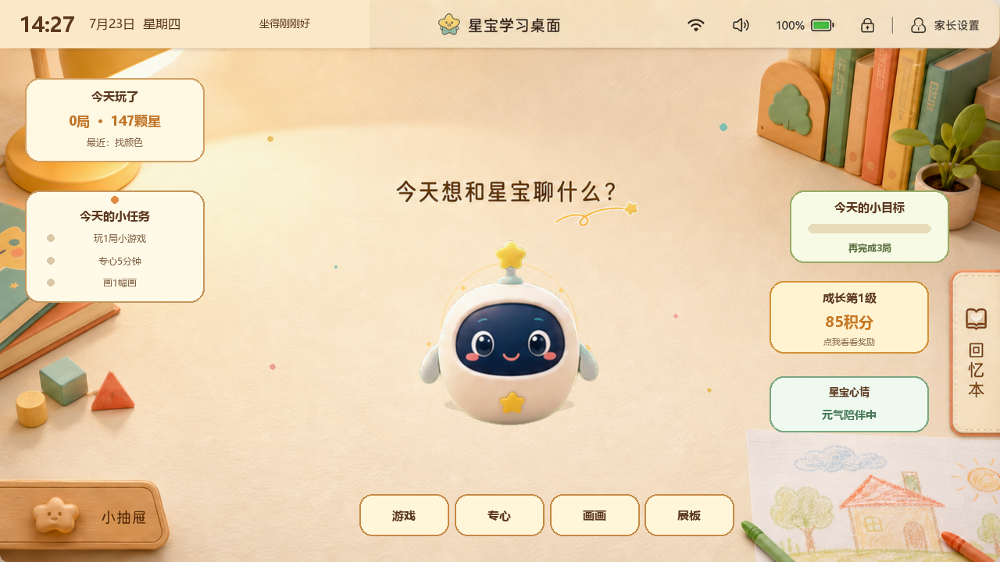
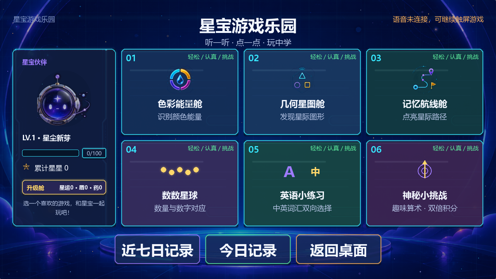
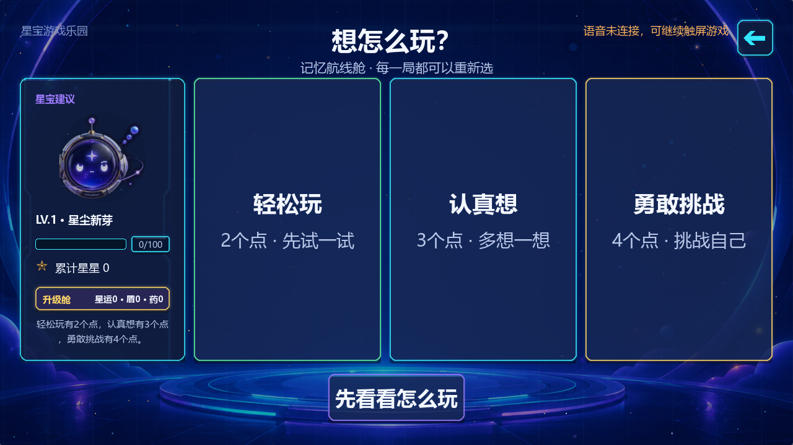
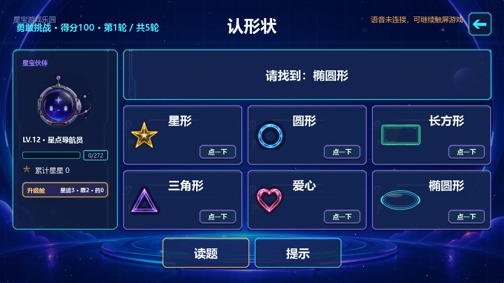
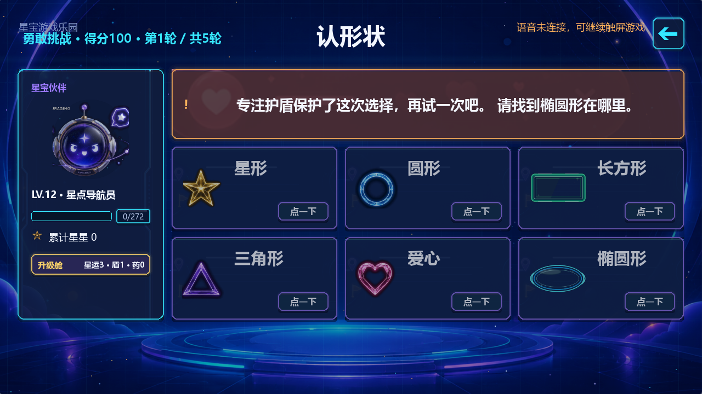
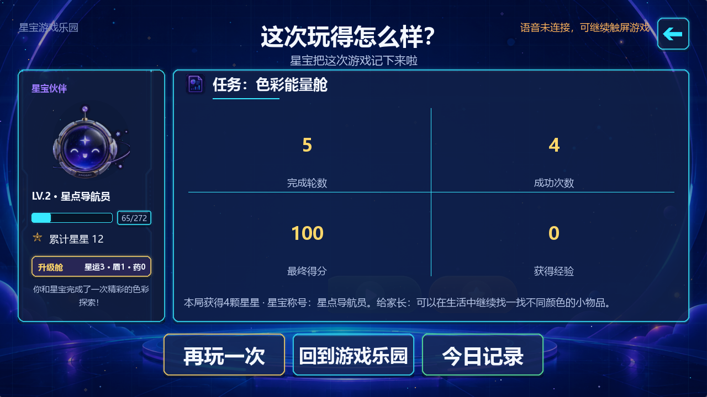

# 星宝核心流程 UX 审查与优化记录

审查日期：2026-07-23  
审查范围：桌面入口 → 游戏主页 → 难度选择 → 读题/答题 → 语音反馈 → 游戏小结  
目标用户：学龄前儿童，以及在旁协助的家长  
取证方式：使用本次代码在 1280×720 视口实时渲染并保存截图；所有截图均在本次审查中重新生成和检查。

## 总体结论

核心流程已经连通，主要触控区域足够大，题目和反馈的视觉层级清楚。此次优化重点解决了此前最影响体验的三类问题：

1. 语音是否正在播放、是否完成、是否不可用，页面原来完全不可见；
2. 答题反馈页按固定时间跳转，与真实语音播放时长不一致；
3. 游戏界面使用大量硬件、控制台和难度术语，不适合儿童直接理解。

当前核心流程可用性为“良好”。仍需在板卡物理屏上补做音量、扬声器延迟、触摸误触、字体实际观感和动效舒适度验证。

## 流程步骤

### 1. 桌面入口：良好

- 优点：主任务集中在底部，按钮大；星宝角色是清晰的视觉中心；游戏入口容易找到。
- 风险：桌面是温暖的儿童房风格，进入游戏后切换为深色太空控制台，视觉语言差异较大。
- 建议：后续统一角色、按钮圆角、字体和背景质感，减少“像进入另一套产品”的感觉。

### 2. 游戏主页：良好

- 已优化：标题改为“星宝游戏乐园”，去掉 SC171V3、AIoT Console 等开发术语。
- 已优化：难度提示改成“轻松 / 认真 / 挑战”；“退出”改成“返回桌面”。
- 已优化：右上角显示语音连接与播放状态，语音不可用时明确说明仍可触屏游戏。
- 风险：左侧等级、星运、护盾和药水信息较密，低龄儿童不容易理解。
- 建议：后续将成长信息折叠成一个“我的星星”入口，主页只保留等级和星星数。

### 3. 难度选择：良好

- 已优化：“低/中/高难度”改成“轻松玩/认真想/勇敢挑战”。
- 已优化：“演示本模式”改成“先看看怎么玩”，更符合儿童意图。
- 优点：三张卡片都是大触控目标，返回按钮位置固定。
- 风险：经验和成长奖励仍需要家长解释；当前已先把选择数量和挑战程度说清楚。

### 4. 题目与读题：良好

- 已优化：“锁定目标”改成直接的“请找到”。
- 已优化：选项卡提示从 74×28 的“选择”小框扩大到 92×34 的“点一下”；真正触控范围仍是整张卡片。
- 优点：“读题”和“提示”位于固定底栏，孩子找不到答案时有明确恢复路径。
- 风险：Pygame 画布没有原生语义树，无法仅凭截图证明屏幕阅读器可访问性。

### 5. 语音反馈：良好

- 已优化：反馈页不再按固定 1.15 秒强制跳转；至少展示 1.15 秒，并等待匹配语音的 `finished` 或 `failed` 回执。
- 已优化：语音服务无响应时最多等待 8 秒后安全进入下一题，不会永久卡住。
- 已优化：反馈期间选项区加遮罩，降低“按钮仍能继续点”的误导。
- 风险：截图只能验证视觉状态；是否听清、音量是否合适、声画同步误差仍需物理板卡实测。

### 6. 游戏小结：良好

- 已优化：“星际任务报告”改成“这次玩得怎么样？”，返回按钮改成“回到游戏乐园”。
- 已优化：删掉与左侧鼓励语重复的长句，小结底部只保留星星、称号和家长建议。
- 优点：再玩一次、回主页、看记录三条后续路径清晰。
- 风险：“获得经验 0”容易被理解为没有奖励；后续应在真实结算数据中区分“未获得”与“本局不计算经验”。

## 可访问性与验证边界

- 从截图可确认：主操作目标较大、关键文字和背景对比明显、返回位置基本一致。
- 尚未验证：物理触摸偏移、连续点击去抖、扬声器音量、环境噪声下可懂度、闪烁/动效敏感、键盘焦点、屏幕阅读器语义。
- 本次截图由当前代码在 SDL 渲染环境生成，不是板卡相机拍摄；因此不能把本报告解释为物理设备无障碍合规证明。
- 板卡 `10.21.198.118` 的 22、8765、8766 端口可建立 TCP，但当前均在协议响应前关闭连接；无法取得板卡实机截图或完成远程安装确认。

## 下一轮优先级

1. 恢复 SSH 或提供可用板卡管理入口，部署本次两个发布包。
2. 在物理屏完成“进入游戏 → 读题 → 答对/答错 → 下一题”声画同步录屏。
3. 用 3～6 岁儿童的实际触摸行为验证卡片误触和底部按钮可达性。
4. 统一温暖桌面与太空游戏页的视觉语言，降低场景切换割裂感。
