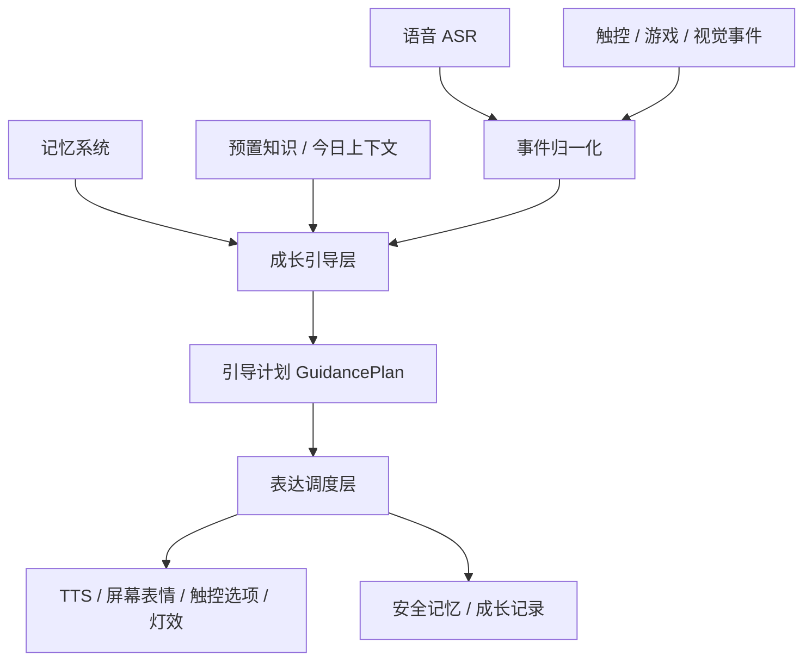

# 星宝成长引导层设计文档

## 1. 定义

成长引导层是星宝从“被动回答问题”升级为“陪伴型成长桌宠”的核心调度层。

它不直接负责 ASR、LLM、TTS、小游戏规则、视觉检测或触控 UI，而是负责判断：

- 当前孩子是在表达观点、表达情绪、请求知识、请求陪玩，还是无明确目标。
- 星宝应该先倾听、复述、鼓励、追问、给选项、讲故事、进入小游戏，还是暂时安静陪伴。
- 今日主题、天气、节日、兴趣知识、小游戏结果、视觉健康提醒，是否适合在当前时机自然引入。
- 哪些内容可以写入非敏感成长记忆，哪些必须丢弃或提醒找成年人。

一句话：

```text
成长引导层 = 机会判断 + 表达支持 + 主动话题 + 成长记录 + 安全边界
```

## 2. 调研依据

### 2.1 回合式陪伴比单次问答更重要

Harvard Center on the Developing Child 将 “serve and return” 描述为儿童与照护者之间来回响应的互动，并指出这种响应式互动会支持早期语言和社会能力发展。它还强调，命名孩子看到、正在做或正在感受的内容，有助于建立语言连接。

对星宝的启发：

- 星宝要做“来回回应”，不能只是一次性输出答案。
- 孩子说得断断续续时，星宝要接住信号，再温柔回应。
- 星宝要帮助孩子命名感受，例如“你是有点难过，还是有点生气？”

参考：https://developingchild.harvard.edu/key-concept/serve-and-return/

### 2.2 早教交互必须适龄、个体化、情境化

NAEYC 的 Developmentally Appropriate Practice 强调，早教实践应基于三个考虑：儿童发展共性、儿童个体差异、儿童所处情境；并强调通过 strengths-based、play-based 的方式促进儿童发展和学习。

对星宝的启发：

- 不能用成人问答方式和孩子交流。
- 同一个端午主题，对 3 岁孩子应是“粽叶是什么颜色”，对 6 岁孩子可以是“为什么要赛龙舟”。
- 星宝要结合孩子兴趣、最近情绪、当前游戏状态来决定怎么说。

参考：https://www.naeyc.org/resources/position-statements/dap/contents

### 2.3 成长引导不只是知识，还包括社会情绪能力

CASEL 将 SEL 的核心放在自我觉察、关系能力、负责任决策等相互关联的能力上，并指出 SEL 支持学习和发展。

对星宝的启发：

- 星宝要帮助孩子识别自己的情绪。
- 星宝要鼓励孩子表达观点，而不是替孩子下结论。
- 小游戏也应服务于表达、规则意识、合作感和自信心。

参考：https://casel.org/fundamentals-of-sel/

### 2.4 儿童 AI 必须以安全、隐私和儿童最佳利益为底线

UNICEF 关于儿童 AI 的指导强调儿童安全、数据与隐私保护、透明可解释、支持儿童发展和福祉等要求。

对星宝的启发：

- 成长引导层不能保存家庭地址、电话、学校、班级、精准位置等敏感信息。
- 星宝不能替代家长、老师、医生或监护人。
- 出现危险、自伤、受伤、身体不适等内容时，必须提醒孩子告诉身边成年人。

参考：https://www.unicef.org/innocenti/reports/policy-guidance-ai-children

## 3. 当前结构与目标结构的差异

### 3.1 当前结构

当前项目已经具备：

- 语音闭环：唤醒、VAD、ASR、LLM、TTS、打断、防重叠。
- 记忆系统：非敏感兴趣、近期话题、表达偏好。
- 预置知识：天气、节日、恐龙等本地知识和今日上下文。
- 表达系统：`touch_event`、`game_event`、`vision_event`、`memory_write_request`、`growth_record_request`。
- 协作协议：小游戏、视觉、触控不能直接抢 TTS，必须发事件给星宝核心。

但当前结构仍偏向：

```text
孩子问什么
→ 星宝回答什么
```

也就是说，知识库更多是“被动命中”。

### 3.2 目标结构

目标结构应是：

```text
孩子表达 / 游戏状态 / 触控选择 / 视觉事件 / 今日主题 / 历史记忆
→ 成长引导层判断当前机会
→ 输出引导计划
→ 表达调度层统一决定说什么、怎么说、屏幕怎么显示、是否记录成长
```

也就是说，星宝不仅知道端午，还知道什么时候适合说端午。

## 4. 成长引导层需要具备的能力

### 4.1 儿童表达理解能力

目标：

识别孩子当前话语背后的意图，不只看字面内容。

需要识别的类型：

| 类型 | 示例 | 星宝策略 |
| --- | --- | --- |
| 唤醒/找陪伴 | 星宝星宝、你在吗 | 简短回应，打开对话窗口 |
| 表达不清 | 今天那个……他不让我…… | 放慢节奏，猜测但不武断 |
| 情绪表达 | 我不开心、我生气了 | 命名情绪，给选择 |
| 观点表达 | 我觉得这个不好玩 | 鼓励说原因，不否定 |
| 知识请求 | 端午是什么、恐龙吃什么 | 使用知识库或 LLM 科普 |
| 故事请求 | 我想听恐龙故事 | 进入故事模式，结合兴趣知识 |
| 游戏请求 | 我想玩、帮帮我 | 进入小游戏协同 |
| 拒绝/没兴趣 | 我不想玩这个 | 尊重选择，换话题 |
| 危险/身体不适 | 我肚子疼、我受伤了 | 提醒马上告诉成年人 |

技术实现：

- 第一阶段：规则关键词 + LLM 辅助分类。
- 第二阶段：增加轻量意图分类器，输出固定 `growth_intent`。
- 第三阶段：结合历史行为做个体化倾向判断。

建议输出结构：

```json
{
  "growth_intent": "unclear_expression",
  "emotion_signal": "sad_or_frustrated",
  "confidence": 0.72,
  "needs_adult": false,
  "child_wants_topic_change": false
}
```

### 4.2 表达脚手架能力

目标：

当孩子自己表达观点或情绪时，星宝不是替他说完，而是帮他勇敢说出来。

核心流程：

```text
接住 → 复述 → 猜测 → 给选项 → 鼓励继续说 → 整理成一句话
```

示例：

```text
孩子：今天那个……他不让我……
星宝：没关系，我们慢慢说。是有人不让你一起玩吗？
孩子：嗯。
星宝：那你当时是有点生气，还是有点难过？
孩子：难过。
星宝：我们可以这样说：我想一起玩，但被拒绝了，所以我有点难过。
```

能力要求：

- 不催促孩子“说清楚”。
- 不直接评价孩子对错。
- 不强行下结论，要用“是不是”“有可能”。
- 给儿童可点选的表达选项。
- 最后提供一句可模仿的完整表达。

技术实现：

- `ExpressionScaffoldPolicy`
- 输入：ASR 文本、情绪线索、最近上下文、触控选项。
- 输出：星宝话术、屏幕选项、是否进入下一轮追问。

输出示例：

```json
{
  "type": "growth_guidance_plan",
  "scene": "expression_scaffold",
  "priority": 2,
  "speak_text": "没关系，我们慢慢说。是有人不让你一起玩吗？",
  "screen_options": [
    "他不让我玩",
    "我想再说说",
    "不是这个"
  ],
  "next_state": "waiting_child_choice"
}
```

### 4.3 主动话题引导能力

目标：

星宝可以在合适时机主动提起今日主题、孩子兴趣或成长任务。

不是强行插话，而是在机会点轻轻抛出。

适合主动引导的时机：

| 时机 | 示例 | 可引入内容 |
| --- | --- | --- |
| 唤醒开场 | 孩子只说“星宝星宝” | 今日节日、天气、兴趣 |
| 冷场 | 孩子一段时间不说话 | “要不要聊聊今天的端午？” |
| 游戏结束 | 完成一轮小游戏 | 把游戏结果连接到成长主题 |
| 孩子请求玩什么 | “玩什么呀？” | 推荐节日/兴趣小游戏 |
| 情绪稳定后 | 孩子表达完委屈 | 给积极收束或小任务 |
| 成长总结前 | 今日互动结束 | 生成成长记录 |

不适合主动引导的时机：

- 孩子正在表达情绪或讲一件事。
- 孩子明确拒绝该主题。
- 星宝刚刚已经提过同一主题。
- 游戏关键操作中。
- 安全/健康高优先级事件正在处理。

端午示例：

```text
开场：我在呢。今天是端午节哦，等会儿我们可以看看粽叶是什么颜色。
游戏后：你刚才找绿色很准，粽叶也是绿色的。要不要听一个粽子小故事？
冷场：星宝想到一个端午问题：龙舟为什么像一条长长的龙呢？
```

技术实现：

- `ProactiveTopicPolicy`
- 读取 `daily_context.json`、`knowledge_base.json`、记忆系统和当前状态。
- 使用冷却时间和次数限制，避免重复打扰。

建议输出结构：

```json
{
  "topic_id": "dragon_boat",
  "opportunity": "after_game_finished",
  "strength": "light",
  "text": "你刚才找绿色很准，粽叶也是绿色的。要不要听一个粽子小故事？",
  "cooldown_seconds": 900
}
```

### 4.4 兴趣与知识连接能力

目标：

把孩子兴趣、今日主题、小游戏任务连接起来。

例子：

- 孩子喜欢恐龙：讲恐龙故事时自然加入脚印、牙齿、角、尾巴等科普点。
- 今天是端午：颜色小游戏可以出现粽叶绿、龙舟红、糯米白。
- 孩子喜欢积木：空间/形状游戏可以用积木搭桥的语境。

技术实现：

- 本地知识库：`config/knowledge_base.json`
- 今日上下文：`config/daily_context.json`
- 记忆系统：`data/memory.json`
- Prompt 注入：`PromptBuilder.build_system_prompt(user_text)`

成长引导层要做的是：

```text
选主题 → 选切入角度 → 选难度 → 选交互形式
```

交互形式包括：

- 一句轻提示
- 一个小问题
- 一个短故事
- 一个触控选择题
- 一个小游戏任务
- 一条成长记录

### 4.5 游戏成长化能力

目标：

小游戏不是单独玩，而是被星宝包装成成长任务。

小游戏事件进入成长引导层后，应判断：

- 孩子是否完成任务。
- 是否遇到挫折。
- 是否需要鼓励。
- 是否可以连接今日主题。
- 是否应写入成长记录。

例子：

```json
{
  "type": "game_event",
  "source": "mini_game",
  "priority": 1,
  "payload": {
    "event": "child_made_mistake",
    "game_id": "color_game",
    "target": "green"
  }
}
```

成长引导层输出：

```json
{
  "scene": "game_encouragement",
  "speak_text": "这一点有点难，没关系。我们再找一次绿色。",
  "screen_expression": "encouraging",
  "memory_signal": "child_kept_trying"
}
```

如果今天是端午，可以轻连接：

```text
绿色像粽叶的颜色，我们再找找它在哪里。
```

### 4.6 成长记录能力

目标：

把一次互动中值得保留的非敏感成长线索，整理成温暖记录。

可记录：

- 今天愿意表达“我有点难过”。
- 遇到错误后愿意再试一次。
- 对恐龙、端午、天气表现出兴趣。
- 喜欢用触控选项慢慢表达。

不可记录：

- 家庭地址、电话、学校、班级。
- 精确位置。
- 家长联系方式。
- 原始音频、原始照片、视频。
- 医疗诊断或心理标签。

成长记录示例：

```text
今日成长星星：
- 小宇今天愿意把“我有点难过”说出来。
- 小宇在颜色任务里遇到困难后，又试了一次。
- 小宇对端午的粽叶颜色很感兴趣。
```

### 4.7 安全兜底能力

成长引导层必须优先处理安全事件。

高优先级场景：

- 身体不舒服、受伤。
- 孩子说被伤害、害怕、危险。
- 明显成人化、暴力、恐怖内容。
- 询问隐私或透露敏感信息。
- 摄像头/麦克风/TTS/ASR 失败。

策略：

- 不诊断。
- 不恐吓。
- 不承诺保密。
- 温柔提醒找爸爸妈妈、老师或身边大人。
- 同时屏幕给出“告诉大人”的明确提示。

## 5. 系统架构

### 5.1 逻辑位置



### 5.2 推荐模块

建议新增：

```text
core/growth_guidance.py
config/growth_guidance_rules.json
tests/test_growth_guidance.py
docs/XINGBAO_GROWTH_GUIDANCE_LAYER_DESIGN.md
```

核心类：

```python
class GrowthGuidanceEngine:
    def plan(self, event: dict, context: GrowthContext) -> GrowthGuidancePlan:
        ...
```

建议数据结构：

```python
@dataclass
class GrowthContext:
    state: str
    child_memory: dict
    daily_context: dict
    current_game: dict | None
    recent_topics: list[str]
    last_proactive_topic_at: dict[str, float]
    child_is_speaking: bool

@dataclass
class GrowthGuidancePlan:
    scene: str
    priority: int
    speak_text: str
    screen_text: str
    screen_options: list[str]
    expression: str
    led_mode: str
    memory_request: dict | None
    next_state: str
    reason: str
```

### 5.3 状态机

建议状态：

| 状态 | 含义 |
| --- | --- |
| `idle` | 待唤醒 |
| `opening` | 唤醒开场 |
| `listening` | 正在听孩子说话 |
| `understanding` | 理解意图和情绪 |
| `expression_scaffold` | 引导孩子表达 |
| `proactive_topic` | 主动抛话题 |
| `storytelling` | 故事和科普 |
| `playing_game` | 陪玩小游戏 |
| `health_reminding` | 健康提醒 |
| `summarizing` | 成长记录 |
| `fallback` | 兜底 |

状态转移示例：

```text
opening
→ listening
→ understanding
→ expression_scaffold
→ playing_game
→ proactive_topic
→ summarizing
```

## 6. 策略设计

### 6.1 优先级

| 优先级 | 类型 | 例子 |
| --- | --- | --- |
| 3 | 安全/健康 | 受伤、身体不适、离屏太近 |
| 2 | 情绪/表达 | 难过、生气、表达不清 |
| 1 | 当前任务 | 小游戏提示、知识问答、故事 |
| 0 | 主动话题 | 端午、天气、兴趣延展 |

规则：

- 安全高于一切。
- 孩子正在表达时，不插入节日话题。
- 主动话题必须有冷却时间。
- 同一主题一天内不应频繁重复。
- 游戏中的成长反馈要短，不抢孩子注意力。

### 6.2 主动话题机会判断

建议规则：

```text
can_proactively_talk =
  not child_is_speaking
  and state in {opening, idle_gap, after_game, after_success, summary_ready}
  and no_high_priority_event
  and topic_not_rejected
  and cooldown_passed
```

机会强度：

| 强度 | 用法 | 示例 |
| --- | --- | --- |
| `hint` | 轻轻带一句 | 今天是端午哦。 |
| `invite` | 邀请孩子选择 | 要不要听一个粽子小故事？ |
| `activity` | 进入任务 | 我们来找找粽叶绿。 |
| `summary` | 成长总结 | 今天你认识了端午的粽叶绿。 |

### 6.3 表达脚手架策略

推荐模板：

| 场景 | 模板 |
| --- | --- |
| 表达不清 | 没关系，我们慢慢说。是不是……？ |
| 情绪不明 | 你现在更像是生气，还是有点难过？ |
| 鼓励观点 | 你的想法很重要，可以再告诉我一点吗？ |
| 整理表达 | 我们可以这样说：…… |
| 拒绝尊重 | 好的，我们先不聊这个。你想换一个吗？ |

### 6.4 记忆写入策略

成长引导层只提出写入请求，不直接写 memory。

```json
{
  "type": "memory_write_request",
  "source": "growth_guidance",
  "payload": {
    "memory_kind": "growth_note",
    "content": "孩子今天能说出自己有点难过。",
    "sensitivity": "non_sensitive"
  }
}
```

由现有 memory sanitizer 再做一次过滤。

## 7. 技术选型

### 7.1 规则引擎 + LLM 混合

第一版不要完全依赖 LLM。

建议：

- 安全、隐私、优先级、冷却时间：规则引擎。
- 情绪和表达意图：规则 + LLM 分类。
- 最终儿童友好话术：模板优先，LLM润色可选。
- 知识和节日：本地知识库优先。

原因：

- 稳定。
- 可测试。
- 低延迟。
- 不会因为 LLM 漂移破坏儿童安全边界。

### 7.2 本地 RAG / 知识卡

当前已具备：

- `config/knowledge_base.json`
- `config/daily_context.json`
- `core/knowledge_base.py`

成长引导层应复用它们，不重新发明一套知识系统。

### 7.3 事件驱动

继续沿用项目协议：

- 小游戏只发 `game_event`
- 视觉只发 `vision_event`
- 触控只发 `touch_event`
- 成长引导层输出 `growth_guidance_plan`
- 表达调度层统一 TTS、屏幕、灯效、记忆

### 7.4 状态机

状态机用于防止星宝乱插话。

例如：

- `expression_scaffold` 状态下，端午主动话题降级或延后。
- `playing_game` 状态下，只允许短提示。
- `health_reminding` 状态下，不进入故事。

### 7.5 可观测日志

每次成长引导决策都要记录：

```json
{
  "type": "growth_guidance_decision",
  "scene": "proactive_topic",
  "selected_topic": "dragon_boat",
  "reason": "after_game_finished_and_cooldown_passed",
  "rejected_topics": ["weather"],
  "priority": 0
}
```

这样方便调试“为什么星宝突然说端午”或“为什么没说端午”。

## 8. MVP 实现范围

第一版只做 5 个场景：

1. 唤醒开场：如果今天有节日，轻轻提一句。
2. 表达不清：引导孩子慢慢说，给二选一/三选一。
3. 游戏结束：把游戏结果连接到一个成长反馈或今日主题。
4. 冷场：孩子一段时间不说话，抛一个轻话题。
5. 成长记录：生成一条非评价式总结。

第一版不做：

- 复杂心理分析。
- 长期学习路径推荐。
- 医疗/心理诊断。
- 多轮课程系统。
- 完全自动化家长报告。

## 9. 与现有模块的对接

### 9.1 与语音模块

语音模块负责：

```text
ASR → 文本 → 成长引导层 → 星宝回应 → TTS
```

语音模块不负责判断孩子成长目标。

### 9.2 与表达系统

成长引导层输出计划，表达系统负责执行。

```text
GrowthGuidancePlan
→ ExpressionDispatcher
→ speak_text / screen_text / expression / led_mode / memory_request
```

### 9.3 与小游戏

小游戏只提供状态和事件：

```json
{
  "type": "game_event",
  "payload": {
    "event": "game_finished",
    "game_id": "color_game",
    "result": "completed"
  }
}
```

成长引导层决定：

- 是否鼓励。
- 是否连接今日主题。
- 是否生成成长记录。

### 9.4 与视觉模块

视觉模块只输出观察事件，不输出结论：

```json
{
  "type": "vision_event",
  "payload": {
    "event": "sitting_too_long",
    "duration_seconds": 1200
  }
}
```

成长引导层决定温和话术：

```text
我们坐了一会儿啦，要不要站起来伸个懒腰？
```

### 9.5 与记忆系统

成长引导层只能提出写入请求：

- interest
- communication_style
- recent_mood
- learning_preference
- growth_note
- game_preference

敏感信息仍由 `MemoryManager` 拒绝。

## 10. 评委演示脚本中的作用

成长引导层应让评委看到：

1. 星宝会主动但不打扰。
2. 星宝能听孩子慢慢表达。
3. 星宝能把孩子的话整理成更完整的表达。
4. 星宝能把小游戏变成成长任务。
5. 星宝能自然提起今天的端午/父亲节/天气。
6. 星宝能留下温暖的成长记录。

推荐演示片段：

```text
孩子：星宝星宝。
星宝：我在呢。今天是端午节哦，等会儿我们可以看看粽叶是什么颜色。

孩子：今天那个……他不让我……
星宝：没关系，我们慢慢说。是有人不让你一起玩吗？

孩子选择：他不让我玩。
星宝：那你当时是有点生气，还是有点难过？

孩子选择：难过。
星宝：我们可以这样说：我想一起玩，但被拒绝了，所以我有点难过。

星宝：你刚才把感受说出来了。我们来玩一个粽叶绿色小任务吧。
```

## 11. 验收标准

### 11.1 功能验收

- 唤醒开场能根据今日上下文轻提节日。
- 孩子表达不清时，星宝能进入表达脚手架。
- 孩子拒绝话题时，星宝能停止主动引导。
- 游戏结束后，星宝能给成长化反馈。
- 视觉健康事件能被温和表达。
- 成长记录不包含敏感信息。

### 11.2 体验验收

- 星宝不像百科问答。
- 星宝不会频繁打断孩子。
- 星宝鼓励孩子表达，而不是替孩子做判断。
- 星宝主动话题自然，不像广告或硬塞课程。
- 星宝话术短、暖、有儿童感。

### 11.3 技术验收

- 所有成长引导输出可测试。
- 所有主动话题有 reason 日志。
- 同一主题有冷却时间。
- 高优先级安全事件能覆盖低优先级主动话题。
- 不新增敏感信息存储。

## 12. 后续实施计划

### 阶段 1：规则骨架

- 新增 `core/growth_guidance.py`
- 定义 `GrowthContext` 和 `GrowthGuidancePlan`
- 支持唤醒开场、表达不清、游戏结束、视觉提醒四类输入
- 增加单元测试

### 阶段 2：主动话题

- 接入 `KnowledgeBase`
- 支持今日节日、天气、兴趣主题
- 增加冷却时间和拒绝记忆
- 记录 `growth_guidance_decision`

### 阶段 3：表达脚手架

- 支持二选一/三选一触控选项
- 支持“整理成一句话”
- 支持成长记录信号

### 阶段 4：演示闭环

- 将成长引导层接入 `run_voice_once`
- 接入小游戏 `game_event`
- 接入视觉模拟事件
- 形成评委演示链路

### 阶段 5：板卡实测

- 校准麦克风、音响、触控屏。
- 验证响应速度。
- 验证打断和主动话题不会重叠播报。

## 13. 结论

成长引导层是星宝从“能聊天”变成“会陪伴成长”的关键。

它不是增加更多话术，也不是把 LLM 提示词写得更长，而是在星宝核心里增加一个明确的判断层：

```text
现在孩子需要什么？
现在适合星宝主动说什么吗？
这句话是否帮助孩子表达、探索、玩耍或成长？
```

只要这层建立起来，天气、端午、恐龙、小游戏、视觉健康提醒、成长记录都会从零散功能变成一个统一体验：星宝在陪孩子慢慢长大。
